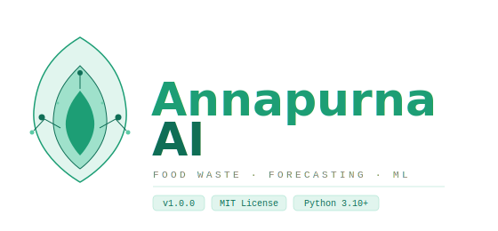

<div align="center">



<br/>

**Intelligent demand forecasting for commercial kitchens, vendors, and NGOs.**  
Cut waste. Predict smarter. Feed more.

[](https://python.org)
[](https://flask.palletsprojects.com)
[](https://reactjs.org)
[](https://scikit-learn.org)
[](https://postgresql.org)
[](https://firebase.google.com)
[](LICENSE)

</div>

---

## ✦ Overview

**Annapurna AI** is a production-ready full-stack platform that applies machine learning to one of the most underserved problems in food systems — **kitchen-level food waste**. It empowers operators to log daily food quantities, receive AI-powered demand forecasts, and visualize waste trends through a clean, real-time dashboard.

> Named after the Annapurna massif — a symbol of abundance and sustenance — this platform is built for those who feed communities at scale.

---

## ⚙️ Architecture

```
┌─────────────────────────────────────────────────────┐
│                   ANNAPURNA AI                      │
│                                                     │
│  ┌──────────────┐     ┌──────────────────────────┐  │
│  │   Frontend   │────▶│       Backend API        │  │
│  │  React/Vite  │     │   Flask + SQLAlchemy     │  │
│  │  Tailwind    │◀────│   Firebase Auth Verify   │  │
│  └──────────────┘     └────────────┬─────────────┘  │
│                                    │                 │
│              ┌─────────────────────┼──────────────┐  │
│              │                     │              │  │
│       ┌──────▼──────┐     ┌────────▼─────┐        │  │
│       │  PostgreSQL  │     │  ML Engine   │        │  │
│       │  (SQLite     │     │  RandomForest│        │  │
│       │   fallback)  │     │  Scikit-learn│        │  │
│       └─────────────┘     └─────────────┘        │  │
└─────────────────────────────────────────────────────┘
```

| Layer | Technology | Purpose |
|-------|-----------|---------|
| **Frontend** | React 18, Vite, Tailwind CSS | Glassmorphism + Neobrutalism UI |
| **Backend** | Python, Flask, SQLAlchemy | REST API, auth middleware |
| **Database** | PostgreSQL / SQLite | Persistent food log storage |
| **Auth** | Firebase Auth | Secure user identity |
| **ML Engine** | Scikit-learn `RandomForestRegressor` | Demand forecasting |

---

## 📁 Project Structure

```
ai-food-waste-management/
│
├── 📂 frontend/               # React + Vite SPA
│   ├── src/
│   │   ├── pages/             # Dashboard, Analytics, Prediction, Data Entry
│   │   ├── components/        # Reusable UI components
│   │   └── hooks/             # Firebase auth, API hooks
│   ├── vercel.json            # SPA routing config
│   └── .env.example
│
├── 📂 backend/                # Flask REST API
│   ├── routes/                # /api/logs, /api/predict, /api/menu
│   ├── models/                # SQLAlchemy ORM models
│   ├── auth/                  # Firebase token verification
│   ├── run.py                 # App entrypoint
│   └── Procfile               # Gunicorn for production
│
├── 📂 ml_models/              # ML pipeline
│   ├── training/
│   │   └── train_model.py     # Training script (CSV or synthetic mode)
│   ├── models/
│   │   ├── demand_model.pkl   # Trained RandomForest (generated)
│   │   └── model_meta.json    # Feature names, training date
│   └── data/
│       └── dataset.csv        # Historical food quantity data
│
├── 📂 database/               # Schema & migration docs
├── .env.example               # All required environment variables
└── README.md
```

---

## 🚀 Local Development

### Prerequisites

```
Python  ≥ 3.10
Node.js ≥ 18
Firebase project (for Auth)
```

---

### 1 · Backend Setup

```bash
cd backend
python -m venv venv

# Activate virtual environment
source venv/bin/activate          # macOS / Linux
# venv\Scripts\activate           # Windows

pip install -r requirements.txt
```

---

### 2 · Train the ML Model

The demand forecasting model must be trained before the `/predict` endpoint works. Run this once from the **project root**:

```bash
python -m ml_models.training.train_model --mode csv
```

This generates:
- `ml_models/models/demand_model.pkl` — the trained `RandomForestRegressor`
- `ml_models/models/model_meta.json` — feature names and training metadata

---

### 3 · Configure Environment

```bash
cp .env.example backend/.env
```

Edit `backend/.env` with your values. At minimum you need:

```env
DATABASE_URL=sqlite:///./annapurna.db          # SQLite for local dev
FIREBASE_CREDENTIALS_JSON='{...}'              # Or path to firebase_service_account.json
SECRET_KEY=your-flask-secret-key
```

> **Firebase:** Drop your `firebase_service_account.json` inside `backend/`, or paste its JSON content into `FIREBASE_CREDENTIALS_JSON`.

---

### 4 · Run the Backend

```bash
cd backend
flask run --port=5000
```

On first run, Flask auto-creates the database schema and seeds default menu items.

---

### 5 · Run the Frontend

```bash
cd frontend
npm install
npm run dev
```

Create `frontend/.env` from `.env.example` and set:

```env
VITE_API_BASE_URL=http://localhost:5000
VITE_FIREBASE_API_KEY=...
VITE_FIREBASE_AUTH_DOMAIN=...
VITE_FIREBASE_PROJECT_ID=...
```

---

## ☁️ Deployment

### Backend → Railway / Heroku

```bash
# 1. Provision a PostgreSQL database — DATABASE_URL is injected automatically
# 2. Set all environment variables from .env.example
# 3. For Firebase in production, use the env var (never commit the JSON file):
FIREBASE_CREDENTIALS_JSON='{"type":"service_account", ...}'

# The Procfile handles the rest:
# web: gunicorn --workers=4 run:app
```

### Frontend → Vercel

```bash
# 1. Import the /frontend directory as a new Vercel project
# 2. Framework preset: Vite  |  Build: npm run build  |  Output: dist
# 3. Set environment variables:
VITE_API_BASE_URL=https://your-backend.railway.app
VITE_FIREBASE_API_KEY=...

# vercel.json ensures SPA routing (no 404s on page refresh)
```

---

## 🧪 Validation Checklist

Use this flow to verify the full system is working end-to-end:

```
[ ]  Sign up via the auth flow
[ ]  Log food quantities on the Data Entry page
[ ]  Confirm data appears in Dashboard charts (live API)
[ ]  Check Analytics page for waste trend visualization
[ ]  Open Prediction page → select a meal → verify ML returns
       a forecast value + confidence score
```

---

## 🌿 Key Features

- **ML Demand Forecasting** — `RandomForestRegressor` trained on historical food logs predicts per-item demand with confidence scoring
- **Real-time Dashboard** — Live charts for waste tracking, quantity trends, and daily summaries
- **Role-based Access** — Firebase Auth with support for kitchen operators, vendors, and NGO users
- **Dual DB Support** — PostgreSQL in production, SQLite for zero-config local development
- **SPA Architecture** — Vite + React with full client-side routing and protected routes

---

## 🛠️ Tech Stack Reference

```
Frontend      React 18 · Vite · Tailwind CSS · Glassmorphism/Neobrutalism
Backend       Flask · SQLAlchemy · Gunicorn
Database      PostgreSQL (prod) · SQLite (dev)
Auth          Firebase Authentication
ML            Scikit-learn · Pandas · NumPy
Deployment    Vercel (frontend) · Railway/Heroku (backend)
```

---

## 📄 License

MIT © 2024 — Built with purpose, for those who feed communities.

---

<div align="center">
  <sub>🌿 Less waste. Better forecasts. More impact.</sub>
</div>
